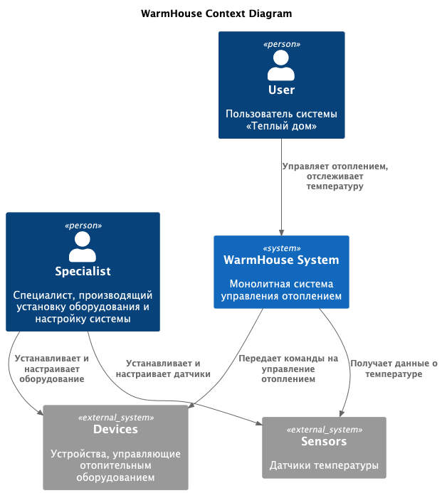
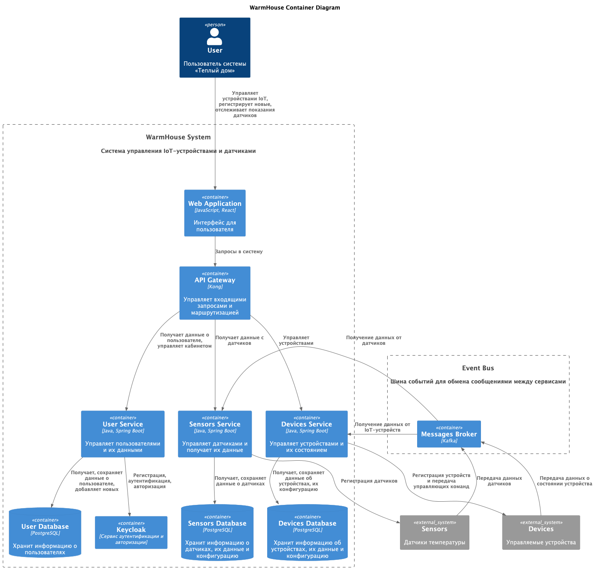
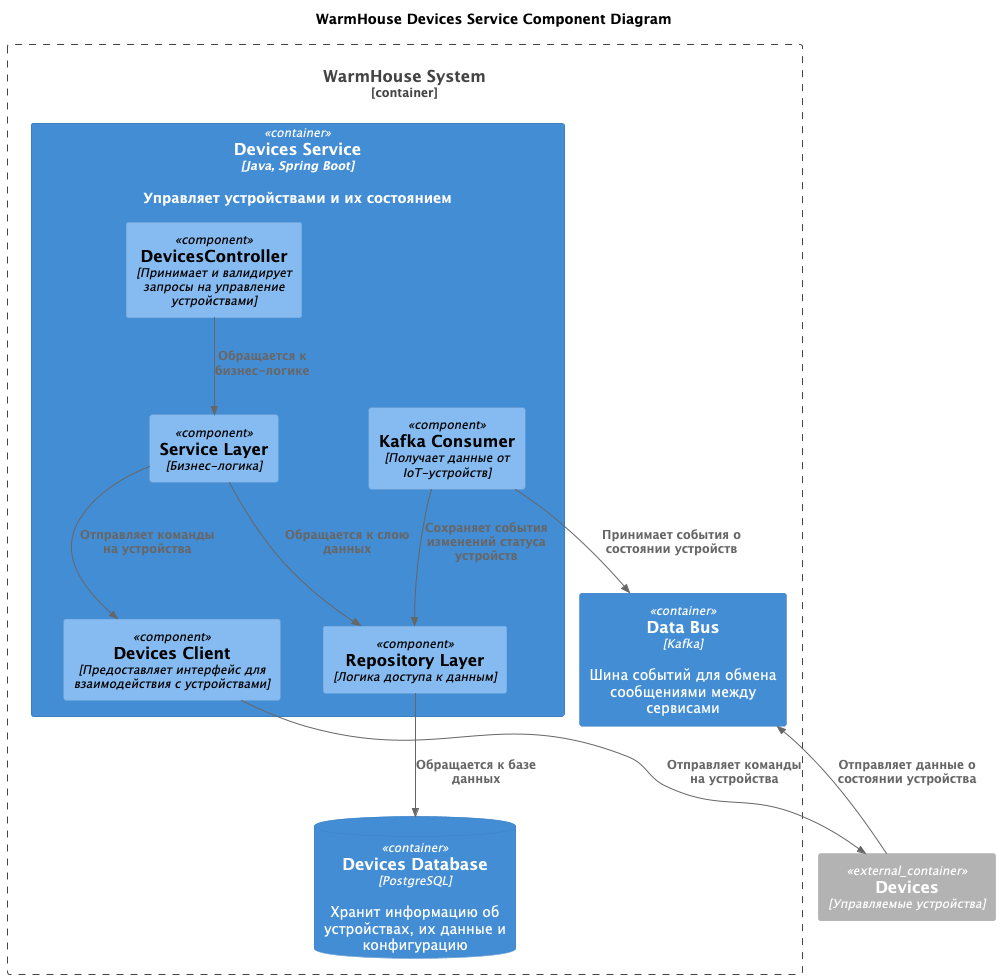
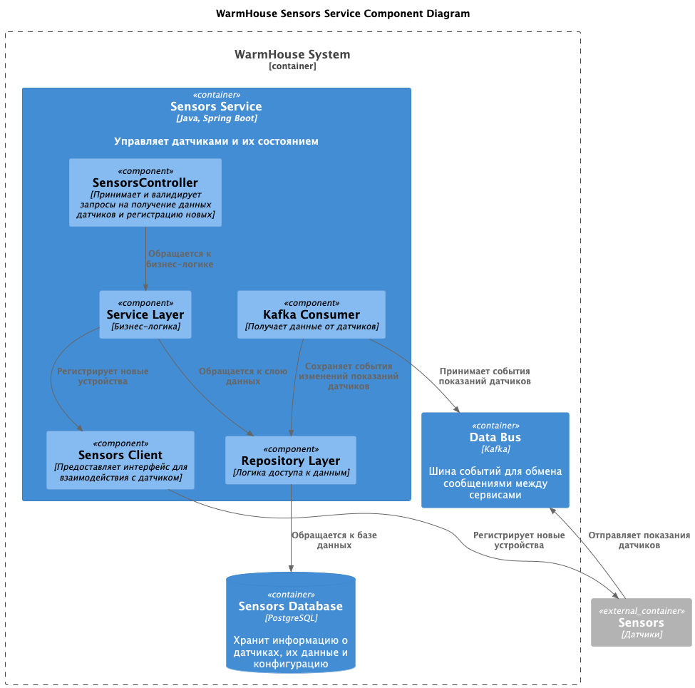
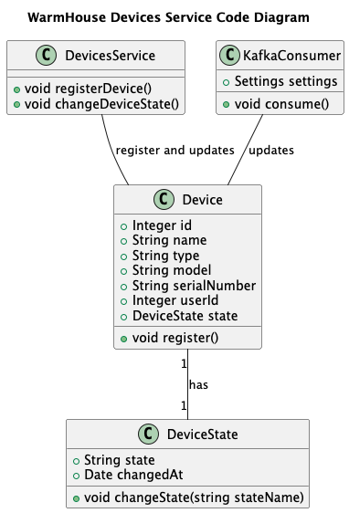
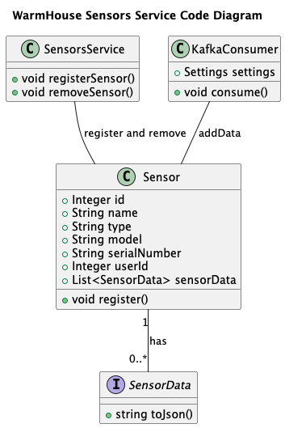
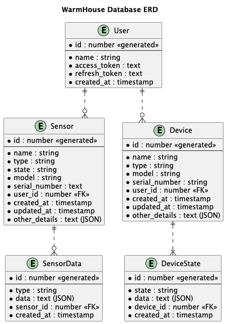

# Project_template

Тип: Материал
Родитель: Описание проекта для 11 когорты (https://www.notion.so/11-03abbbbc8bcb49ed9b85c9b6d1174056?pvs=21)

Это шаблон для решения проектной работы. Структура этого файла повторяет структуру заданий. Заполняйте его по мере работы над решением.

# Задание 1. Анализ и планирование

<aside>
💡

Чтобы составить документ с описанием текущей архитектуры приложения, можно часть информации взять из описания компании и условия задания. Это нормально.

</aside>

### 1. Описание функциональности монолитного приложения

**Управление отоплением:**

- Пользователи могут удалённо включать/выключать отопление в своих домах
- Система поддерживает установку нового оборудования только специалистом компании

**Мониторинг температуры:**

- Пользователи могут удалённо отслеживать температуру в своих домах через веб-интерфейс
- Монолитное приложение запрашивает температуру с датчиков, которые установлены в домах пользователей

### 2. Анализ архитектуры монолитного приложения

- Язык программирования: Java
- База данных: PostgreSQL
- Архитектура: Монолитная, все компоненты системы (обработка запросов, бизнес-логика, работа с данными) находятся в рамках одного приложения.
- Взаимодействие: Синхронное, запросы обрабатываются последовательно.
- Масштабируемость: Ограничена, так как монолит сложно масштабировать по частям.
- Развёртывание: Требует остановки всего приложения.

### 3. Определение доменов и границы контекстов

Опишите здесь домены, которые вы выделили.

- Домен: Управление устройствами
    - Контекст: Включение/выключение оборудования

- Домен: Мониторинг датчиков
    - Контекст: Отслеживание показаний датчиков

- Домен: Подключение устройств и датчиков

### **4. Проблемы монолитного решения**

Проблемы существующего монолитного решения в контексте текущих бизнес-задач:
- **Сложность масштабирования**. Монолитное приложение сложно масштабировать, так как все компоненты связаны между собой и отсутствует возможность независимого масштабирования отдельных частей системы.
- **Сложность обновления**. Текущие бизнес-задачи требуют добавления нового функционала в разных частях системы, а монолитное приложение требует полной перезагрузки для обновления, что может привести к простоям.
- **Простой при развертывании**. Существующий монолит требует остановки приложения, что свидетельствует об отсутствии продуманного пайплайна CI/CD. Это может привести к простоям и снижению доступности системы при разработке нового функционала.
- **Синхронное взаимодействие**. Существующее приложение использует синхронные вызовы между компонентами, что может привести к блокировкам и снижению производительности системы при увеличении нагрузки.
- **Высокая вероятность конфликтов в коде**. Из-за большого количества разработчиков, работающих над одним кодом, существует высокая вероятность конфликтов при внесении изменений в код, что может привести к ошибкам и снижению качества кода.

Для решения вышеуказанных проблем необходимо провести рефакторинг существующего монолита и выделить из него микросервисы, которые будут отвечать за отдельные бизнес-задачи. Это позволит улучшить масштабируемость и производительность системы.

### 5. Визуализация контекста системы — диаграмма С4

[context_before.png](docs/img/C4_context_before.png)

# Задание 2. Проектирование микросервисной архитектуры

В этом задании вам нужно предоставить только диаграммы в модели C4. Мы не просим вас отдельно описывать получившиеся микросервисы и то, как вы определили взаимодействия между компонентами To-Be системы. Если вы правильно подготовите диаграммы C4, они и так это покажут.

**Диаграмма контейнеров (Containers)**
[C4_containers.png](docs/img/C4_containers.png)

**Диаграмма компонентов (Components)**

Микросервис Devices:
[C4_component_devices.png](docs/img/C4_component_devices.png)

Микросервис Sensors:
[C4_component_sensors.png](docs/img/C4_component_sensors.png)

**Диаграмма кода (Code)**

Микросервис Devices:
[C4_code_devices.png](docs/img/C4_code_devices.png)

Микросервис Sensors:
[C4_code_sensors.png](docs/img/C4_code_sensors.png)

# Задание 3. Разработка ER-диаграммы

Добавьте сюда ER-диаграмму. Она должна отражать ключевые сущности системы, их атрибуты и тип связей между ними
.
[ER_diagram.png](docs/img/ERD.png)

Четвёртое задание — дополнительное. Его можно сделать по желанию. Чтобы ревьюер быстрее проверил ваше решение, укажите, сделали вы это задание или нет. Для этого оставьте нужный эмодзи около заголовка задания:

✅ — вы выполнили задание.

❌ — вы пропустили задание.

# ❌ Задание 4. Создание и документирование API

### 1. Тип API

Укажите, какой тип API вы будете использовать для взаимодействия микросервисов. Объясните своё решение.

### 2. Документация API

Здесь приложите ссылки на документацию API для микросервисов, которые вы спроектировали в первой части проектной работы. Для документирования используйте Swagger/OpenAPI или AsyncAPI.
